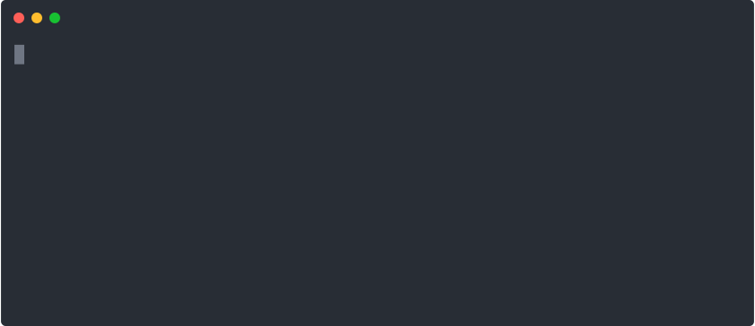

# jomiel-examples

`jomiel-examples` is a selection of examples written in _different
modern programming languages_ showing how the [jomiel] inquiries are
made and the responses are handled.

## Note

The examples are not identical (in terms of the features) but they all
have the same basic functionalities.

## Dockerfiles

You can find a Dockerfile in each `language` specific `docker`
directory. In some cases (e.g. [cpp] or [golang]), there are more than
one Dockerfile (typically one for `alpine-linux` and `debian` image).

To get started, see `jomiel` [HOWTO] for building and running
instructions.

## License

`jomiel-examples` is licensed under the [Apache License version
2.0][aplv2].

[howto]: https://github.com/guendto/jomiel/blob/master/docs/HOWTO.md#build-and-run-jomiel-in-a-container
[aplv2]: https://www.tldrlegal.com/l/apache2
[jomiel]: https://github.com/guendto/jomiel
[cpp]: https://github.com/guendto/jomiel-examples/blob/master/cpp/docker
[golang]: https://github.com/guendto/jomiel-examples/blob/master/golang/docker
