# jomiel-examples

`jomiel-examples` is a selection of examples written in a number of
_different modern programming languages_. These examples show how the
[jomiel] inquiries are made -- and the responses are handled -- using
different programming languages.



**Note**

- The examples may vary; they are not necessarily identical in terms of
  the program features

## Dockerfiles

Each language specific directory contains a dockerfile (some more than
one).

```shell
docker build -t YOUR_TAGNAME -f PATH_TO_DOCKERFILE .
docker run --network host --rm -it YOUR_TAGNAME [args...]
```

For example:

```shell
docker build -t tg/jomiel-examples/c-example -f c/docker/alpine/Dockerfile .
docker run --network host --rm -it tg/jomiel-examples/c-example foo
```

## License

`jomiel-examples` is licensed under the [Apache License version
2.0][APLv2].


[jomiel]: https://github.com/guendto/jomiel
[APLv2]: https://www.tldrlegal.com/l/apache2
